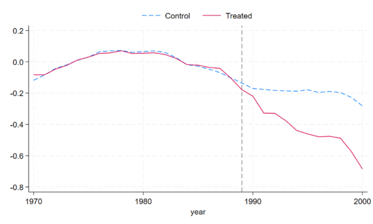
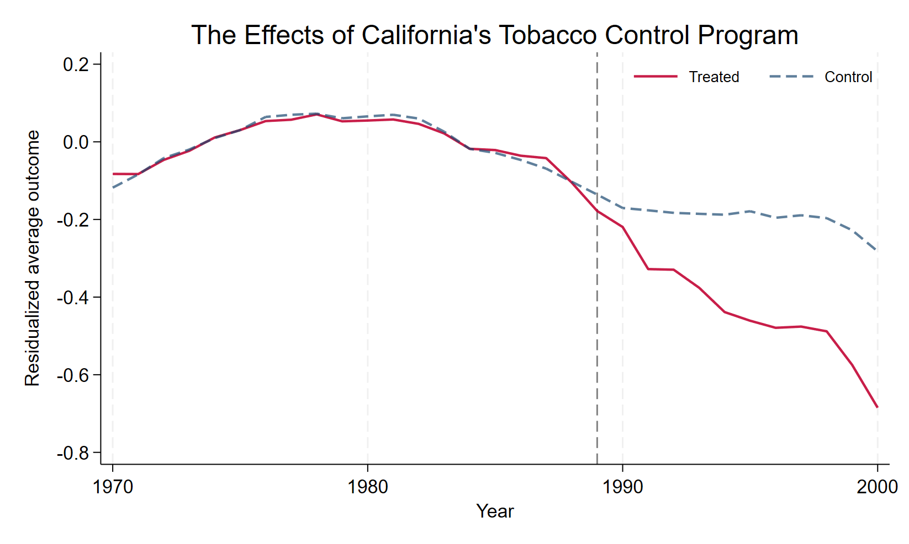
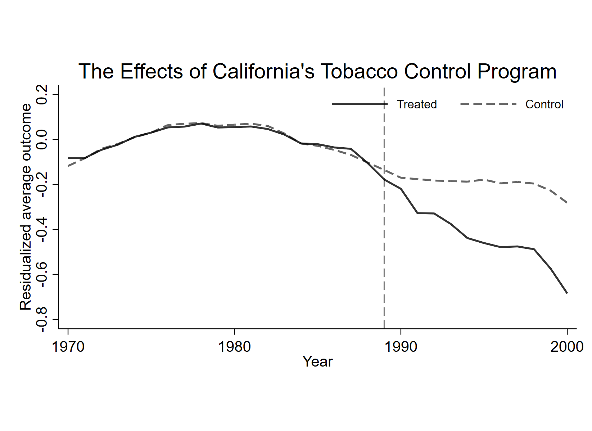
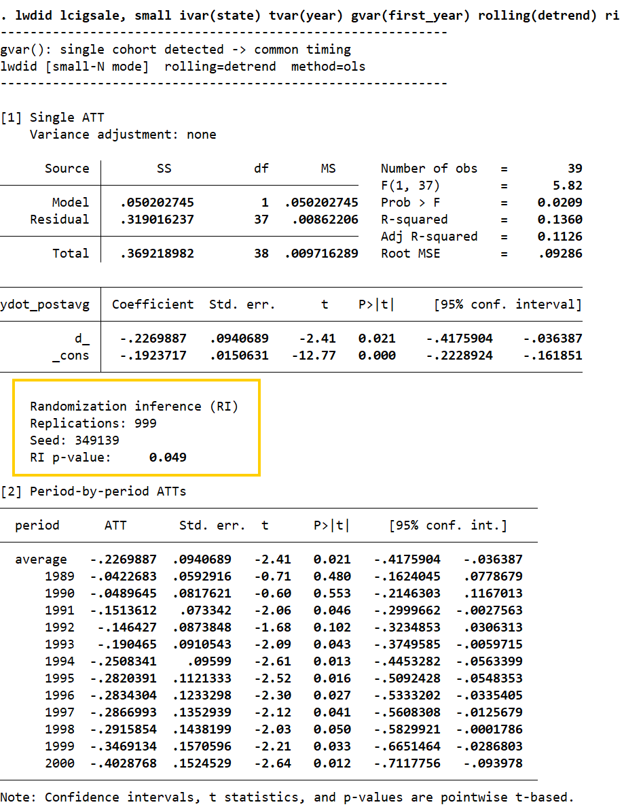
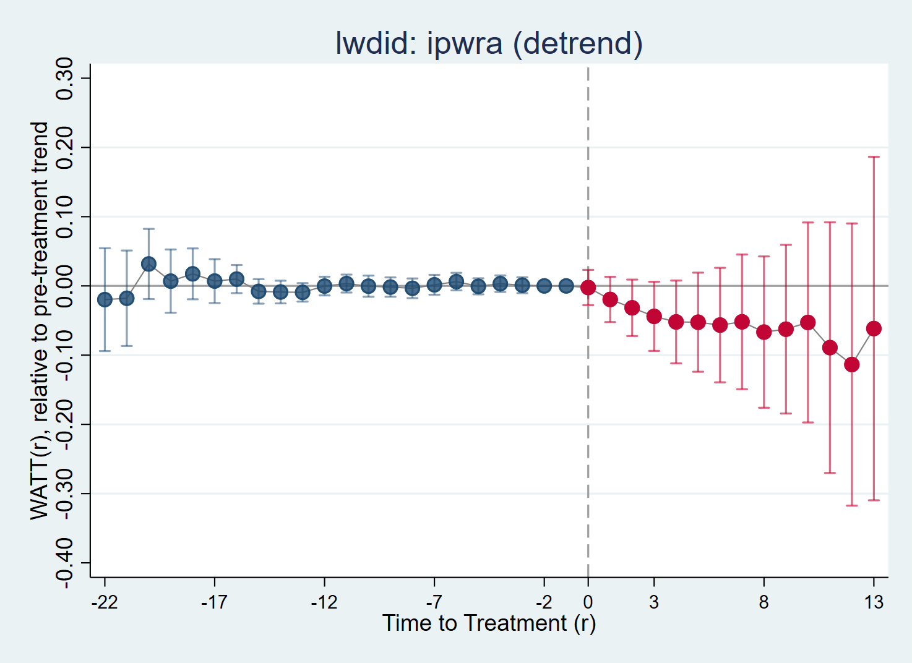
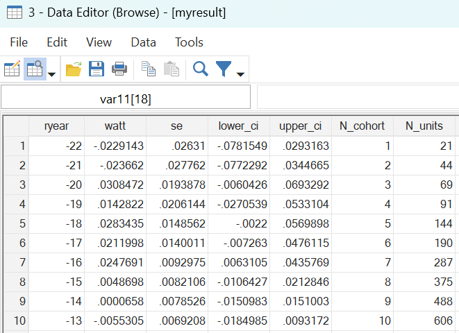

# lwdid

A Stata package that implements the **Rolling Difference-in-Differences Estimator** proposed by Lee and Wooldridge ([2025a](https://papers.ssrn.com/sol3/papers.cfm?abstract_id=4516518), [2026a](https://papers.ssrn.com/sol3/papers.cfm?abstract_id=5325686)). It provides fast and flexible estimation for staggered and common treatment timing in panel data, and offers a unified implementation that accomodates both standard large-N asymptotic settings and cases with small cross-sectional units, where conventional large-N inference may not be reliable.

`lwdid` is a user-written Stata command freely available for academic and research use.
> The package is now available on SSC: `ssc install lwdid`  

A companion manuscript describing the method and software is available at SSRN: Lee and Wooldridge ([2026b](https://dx.doi.org/10.2139/ssrn.6502558)).

<br>

# Contents
- [Installation](#installation)
- [Syntax](#syntax)
- [Examples: Small-N](#small-n-case)
- [Examples: Large-N](#large-n-case)
- [Contact and Updates](#contact-and-updates)
- [Citation](#citation)

<br>

# Installation

You can install the package directly from SSC by running:
```
ssc install lwdid, replace
``` 
> To ensure that you are using the most recent version, run `which lwdid` to verify the installed version,
>
>or reinstall it using `ssc install lwdid, replace`.

 To view the SSC package description, version, and metadata, run:
```
ssc describe lwdid
```
To download the package files provided through SSC, including example files, run:
 ```
net get lwdid  
```

To view the help file and code description, please run:
```
help lwdid
```

<br>

# Syntax
```
lwdid yvar [covariates], ivar(varname) tvar(varname) gvar(varname) rolling(type)
          [method(estimator) small graph gopts(string) scheme(string)
           gid(string) table("filename") save(name)
           ri rireps(#) riseed(#)]
```

To view the full syntax and option descriptions directly in Stata:
```
help lwdid
```

## Option Details 

### **Main Variables**

| Argument | Description                |
|--------------|----------------------------|
| `yvar`       | Outcome variable           |
| `covariates` | Optional control variables  |

---

### **Required Options**

| Option | Description |
|--------|--------------|
| `ivar(varname)` | Panel identifier (numeric or string) |
| `tvar(varname)` | Time variable. The format of the variable determines the data frequency:<br><br>• Annual: numeric year variable (e.g., `year`)<br>• Quarterly: Stata quarterly date (e.g., `%tq`)<br>• Monthly: Stata monthly date (e.g., `%tm`) |
| `gvar(varname)` | Treatment cohort variable (first treated period). Never‐treated units should be coded as 0.|
| `rolling(type)` | Unit-specific Transformation type used to residualize the outcome variable. <br><br> **Available types:** <br> • `demean` – removes the unit-specific pre-treatment mean <br> • `detrend` – removes the unit-specific linear pre-treatment trend <br> • `demeanq` – demeaning with quarter-of-year effects removed <br> • `detrendq` – detrending with quarter-of-year effects removed <br> • `demeanm` – demeaning with month-of-year effects removed <br> • `detrendm` – detrending with month-of-year effects removed <br><br> *Note:* `demeanq`, `detrendq`, `demeanm`, and `detrendm` are currently available only in the small-`N` implementation. These options require `tvar()` and `gvar()` to be defined on the same Stata date scale. <br> See [Example 2: Using Quarterly (or Monthly) Data](#example-2-using-quarterly-data) for details.|


### **Required Estimation Options (depends on implementation)**
| Option | Description |
|--------|--------------|
| `small` | **Small-N Only** <br> Requests the small-sample inference procedure designed for settings with few treated (or control) units (default: large-N inference).|
|`method(ra\|ipw\|ipwra)`| <br>**Large-N Only: required unless `small` is specified**<br>•`method(ra)` –Regression Adjustment estimator <br>•`method(ipw)` – Inverse Probability Weighting estimator. <br>•`method(ipwra)` – Doubly‑robust IPW‑RA estimator.<br><br>|

---

## **Optional Options**

### Graph Options

| Option | Description |
|-------|-------------|
| `graph` | Produces a graph of estimated treatment effects or residualized outcome paths |
| `gopts(string)` | Additional graph options passed directly to the `twoway` command |
| `scheme(string)` | Graph scheme (e.g., `scheme(s1mono)` for black-and-white figures suitable for publication)) |
| `gid(#\|string)` |  **Available option for small-N:** <br> Displays the treated path for a specific unit instead of the average treated trajectory <br> For example, if Michigan and Illinois are treated states and the identifier for Illinois is 9, specifying `gid(9)` plots the treated path for Illinois only.|

### Other Options

| Option | Description |
|------|-------------|
| `save(name)` | Saves estimation results under the specified name |
| `reps(#)` |  **Large-N Only**. Number of wild bootstrap repetitions for large-N inference (default = 999) |
| `vce(vartype)` | **Small-N Only:** Variance estimator for the regression (e.g., `var(robust)`, `var(cluster id)`, `var(hc3)`) |
| `ri` |  **Small-N Only**. Requests randomization inference (RI) <br>•`rireps(#)` –Number of RI repetitions (default = 999).<br>•`riseed(#)` – Seed for reproducible RI p-value (default: randomly drawn; results may differ across runs if not specified)|

---

<br>

# Examples

This section illustrates basic usage of `lwdid` and shows how to replicate the main results reported in the accompanying papers.

# Small-N case

First, load the dataset:
```stata
use lw_smoking, clear
```

> ⚠️ **Important:** The `small` option must be specified for small-N settings.

<br>

## \[Example 1\] Detrended transformation and graph
```
lwdid lcigsale, small ivar(state) tvar(year) gvar(first_year) rolling(detrend) graph
```

By default, `lwdid` reports both:

* the **overall (single) treatment effect**, and
* **period-by-period ATT estimates**.
  
Here, `gvar(first_year)` specifies the first treatment year for each unit (never-treated units should be coded as `0`).  
In this example, only California is treated in 1989, so this is a **single-treatment case**. If multiple units are treated in different years, `lwdid` automatically detects this and applies the **small-N staggered adoption** procedure.

By specifying `rolling(detrend)`, the command performs a __unit-specific detrending tranformation__, allowing each unit to follow its own heterogeneous linear trend and thereby relaxing the parallel trends (PT) assumption.

Alternatively, you can use

```stata
rolling(demean)
```

to remove **unit-specific means** (when the PT assumption hold), instead of **unit-specific trends**.

## \[Example 2\] Using Quarterly (or Monthly) data 

For quarterly data, `rolling(demeanq)` or `rolling(detrendq)` can be used to account for seasonality.  
For monthly data, `rolling(demeanm)` or `rolling(detrendm)` can be used to remove month-of-year effects.

To apply these transformations, `tvar()` must be specified as a **single Stata date variable**:

- quarterly data: a Stata quarterly date variable generated by `yq()` and formatted as `%tq`
- monthly data: a Stata monthly date variable generated by `ym()` and formatted as `%tm`

> ⚠️ **Important:** In all cases, `tvar()` and `gvar()` must use the **same Stata date scale**.  

For example, with quarterly data:

```stata
* Generating `tvar()`
gen tq = yq(year, q)
format tq %tq

* Generating `gvar()`
gen first_treat_q = yq(first_year, first_quarter)
replace first_treat_q = 0 if missing(first_treat_q)
format first_treat_q %tq
```

Then estimation can be carried out as follows:

```stata
lwdid y, small ivar(state) tvar(tq) gvar(first_treat_q) rolling(detrendq) graph
```

In practice, never-treated control units may be coded as `0` or missing. Under Stata’s internal date representation, such values are mapped to the base period (for example, `1960q1` for quarterly dates or `1960m1` for monthly dates), and this convention works properly in the data. For example, the data may look as follows:

| id         | tq     | first_treat_q |
|------------|--------|---------------|
| California | 2008q1 | 2008q3        |
| California | 2008q2 | 2008q3        |
| California | 2008q3 | 2008q3        |
| Illinois   | 2008q1 | 1960q1        |
| Illinois   | 2008q2 | 1960q1        |
| Illinois   | 2008q3 | 1960q1        |

Here, California is first treated in `2008q3`, while Illinois is a never-treated control unit. Since `first_treat_q` is coded as `0` before formatting, Stata displays it as the base quarterly date, `1960q1`.

For monthly data, similarly:

```stata
gen tm = ym(year, month)
format tm %tm

gen first_treat_m = ym(first_year, first_month)
replace first_treat_m = 0 if missing(first_treat_m)
format first_treat_m %tm
```

Then estimation can be carried out as follows:

```stata
lwdid y, small ivar(state) tvar(tm) gvar(first_treat_m) rolling(detrendm) graph
```

<br>

## [Example 3] Customizing graphs using `gopts()` and `scheme()`

The default graph (from Example 1 using the `graph` option) produces a plot comparing **residualized ourcomes of treated and control units**:



You can __easily customize the graph__ through the `gopts()` option, which allows full customization of titles, axes, legends, and other graphical elements. For example:
```
lwdid lcigsale, small ivar(state) tvar(year) gvar(first_year) rolling(detrend) ///
      graph gopts(ytitle("Residualized average outcome") xtitle("Year") ///
      legend(pos(1) ring(0)) ///
      title("The Effects of California’s Tobacco Control Program"))
```
__This produces:__



To generate a **black-and-white version** suitable for journal submissions, you can use the `scheme(s1mono)` option:



<br>

### [Example 4] Randomization Inference (RI) p-values

When using the `ri` option, the command performs a manual randomization inference procedure.
```
lwdid lcigsale, small ivar(state) tvar(year) gvar(first_year) rolling(detrend) ri 
```
By default, it runs `rireps(1000)` replications and does __not__ set a random seed -- meaning that the computed RI p-value will vary slightly each time you run the command.


The calculated RI p-value will be reported at __the end of the results__ (see below):

<div align="center">

</div>

<br>

If you want fully reproducible results, you can specify the seed using `riseed()`. Simillarly you can specify the number of replications using `rireps()`.

```
lwdid lcigsale, small ivar(state) tvar(year) gvar(first_year) rolling(detrend) ri riseed(123) rireps(2000)
```
This specification produces __identical RI p-values__ each time the command is executed, with 2,000 randomization replications and a fixed seed of 123.

<br>

# Large-N case

First, load the dataset:
```
use lw_walmart, clear
```
> ⚠️ **Important:** For the large-N implementation, the `method()` option must be specified.  
>> Available options: <br>
>> `ra` (Regression Adjustment), `ipw` (Inverse Probability Weighting), `ipwra` (Doubly-robust IPWRA).

<br>

### [Example 1] Detrending transformation with the IPWRA estimator

Then run:
```
lwdid log_wholesale_emp x1 x2 x3, ivar(fips) tvar(year) gvar(first_year) ///
rolling(detrend) method(ipwra) graph 
```

Here, `ivar(fips)` identifies states. the dataset includes __multiple treatment groups__, corresponding to a **staggered adoption setting**. If there is only a single treated group, `lwdid` automatically detects this and applies the common timing procedure.

In this example, we use `rolling(detrend)` because the __parallel trends (PT)__ assumption appears to be violated, and apply the the doubly-robust estimator via `method(ipwra)`.

This command produces the default graph plotting **weighted ATTs by relative time `r` (time to treatment)**:

* `r = 0`: the immediate treatment effect
* `r ≥ 1`: post-treatment (dynamic) effects
* `r < 0`: pre-treatment periods

<div align="center">

</div>

<br>

But, similarly, you can customize your graphs with `gopts` and `scheme` options: more over you can save the results, and apply your own graph stayle to plot the event-study graphs.

<br>

### [Example 2] Customizing graphs and saving results

```stata
lwdid log_wholesale_emp x1 x2 x3, ivar(fips) tvar(year) gvar(first_year) ///
      rolling(detrend) method(ipwra) save(myresult) graph scheme(s2color) ///
      gopts( ytitle("WATT") xtitle("Time to Treatment(r)") title("The Effects of Walmart opening on ln(Wholesale Emp)") ///
				ylabel(-.4(.1).25, format(%3.1f) angle(horizontal)) ///
             graphregion(color(white)) plotregion(color(white)) )		
```
In this example:

* `gopts()` adds custom titles and axis labels.
* `scheme()` changes the graph color scheme.
> For a black-and-white version suitable for journal submissions, you can use scheme(s2mono).
> `graphregion(color(white)) plotregion(color(white))` replace the default gray background in `scheme(s2color)` with a clean white background, which is often preferred for presentations and publication-quality figures.

By default, the graph reports **simultaneous confidence bands**, which account for joint uncertainty across all event times, $r$. 

These bands are constructed using a multiplier bootstrap and are typically wider than pointwise intervals because they control coverage over the entire event-study path.

<div align="center">

</div>

The option `save(myresult)` also creates a new dataset `myresult.dta` in your working directory.
This file contains:

* weighted ATT estimates across relative time,
* corresponding **standard errors** and **confidence bands** (computed via a multiplier bootstrap using wild weights),
* `N_cohort`: the number of treated cohorts used compute the estimates.
* `N_units`: the total number of units included in the WATT estimation sample.

<br>
<div align="center">

</div>


# Citation

If you use `lwdid` in your research, please cite the following papers:

**Large-N Procedure**<br>

Soo Jeong Lee, and Jeffrey M. Wooldridge (2025a),
"_A Simple Transformation Approach to Difference-in-Differences Estimation for Panel Data,"
Working Paper_, Available at [SSRN 4516518](https://papers.ssrn.com/sol3/papers.cfm?abstract_id=4516518).
> Revise and resubmit at *Journal of Business & Economic Statistics*.

**Small-N Procedure** <br>
Soo Jeong Lee, and Jeffrey M. Wooldridge (2026a),
"_Simple Approaches to Inference with Difference-in-Differences Estimators with Small Cross-Sectional Sample Sizes,"
Working Paper_, Available at [SSRN 5325686](https://papers.ssrn.com/sol3/papers.cfm?abstract_id=5325686).
> Under review

**lwdid: command guidance** <br>
Soo Jeong Lee, and Jeffrey M. Wooldridge (2026b),
"_Rolling Difference-in-Differences Estimation for Small and Large Panels,"
Working Paper_, Available at [SSRN 6502558](https://dx.doi.org/10.2139/ssrn.6502558).


<br>

## Contact and Updates

Minor updates related to graph plotting (particularly for **Small-N: Staggered adoption** cases) are planned for upcoming releases — please stay tuned.


__For questions or suggestions, feel free to reach out to the authors:__

**[Soo Jeong Lee](https://sites.google.com/view/sjlee-econ/home)** ([soojeong.lee@siu.edu](mailto:soojeong.lee@siu.edu)) , Southern Illinois University Carbondale

**Jeffrey M. Wooldridge** ([wooldri1@msu.edu](mailto:wooldri1@msu.edu)), Michigan State University

<br><br><br><br> <br>


